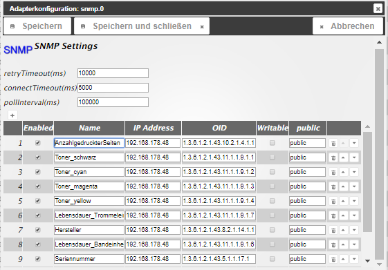

# SNMP Adapter Information

## Allgemeine Informationen

Das SNMP Protocol (Simple Network Management Protocol) wurde entwickelt um zentral alle Netzwerkgeräte zu managen. Dazu gehören Drucker, Router, Switches, Server, Computer etc.

Der SNMP Adapter ist mit Hilfe der sogenannten OID´s (Object Identifier) diese Werte aus dem jeweiligen Gerät auszulesen.

## Administration / Admin-Seite

1. RetryTimeout - Wiederholungszeit in ms
2. connectTimeout - Verbindungsversuch in ms
3. pollInterval - Abrufzeitraum alle XXXX ms

## Drucker

Für die meisten Drucker gibt es einen Standard. (PRINTER MIB)
http://www.oidview.com/mibs/0/Printer-MIB.html

Für den Farblaser Samsung CLP320 sind z.B. folgende OID´s gültig.
Anzahl gedruckter Seiten: 	1.3.6.1.2.1.43.10.2.1.4.1.1

Toner schwarz: 				      1.3.6.1.2.1.43.11.1.1.9.1.1

Toner cyan:				        	1.3.6.1.2.1.43.11.1.1.9.1.2

Toner magenta:				      1.3.6.1.2.1.43.11.1.1.9.1.3

Toner yellow:				        1.3.6.1.2.1.43.11.1.1.9.1.4

Lebensdauer_Bandeinheit:	  1.3.6.1.2.1.43.11.1.1.9.1.6

Lebensdauer_Trommeleinheit: 1.3.6.1.2.1.43.11.1.1.9.1.7

## NAS Systeme - Beispiel

Synology: Standardmäßig ist SNMP bei Synology Diskstations deaktiviert und müssen in der WebUI freigeschalten werden. Wichtig hierbei ist, dass der Port 161 standardmäßig bleibt und Community richtig eingestellt wird. Meist ist es public.

https://global.download.synology.com/download/Document/MIBGuide/Synology_DiskStation_MIB_Guide.pdf

## Die Suche nach dem Hersteller und MIB führt in den meisten Fällen einen Erfolg.

